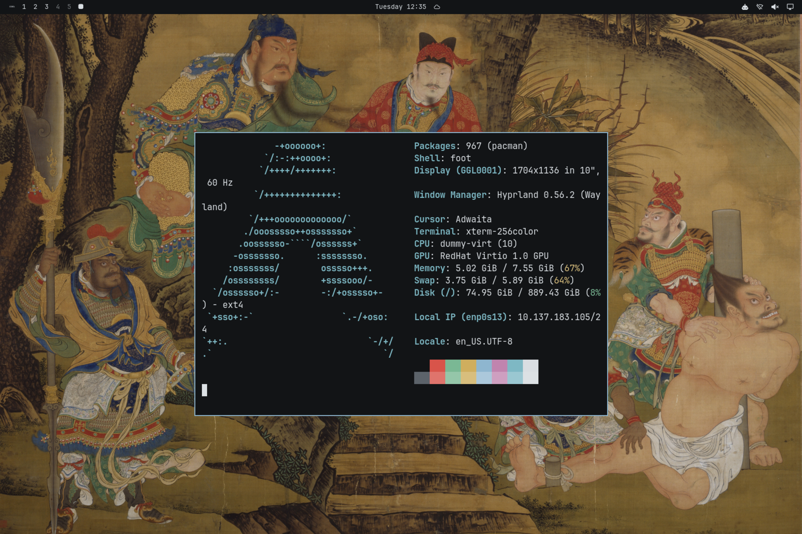

# 武侠·夜 Wuxia Night

夜行衣黑为底、月白为字、剑光冷青为印的深色主题，浅色版为 wuxia。壁纸选用已进入公有领域的中国古代侠义、人物画，截取局部铺满全屏，部分适度压暗。



## 安装

```bash
omarchy theme install https://github.com/rwanglq-ctrl/omarchy-wuxia-night-theme
```

## 壁纸来源

1. 商喜《关羽擒将图》轴局部，明（公有领域，图像来自 Wikimedia Commons）
2. 仇英（传）《蜀道春行图》局部，明（公有领域，图像来自 Wikimedia Commons）
3. 陈洪绶《品茶图》局部，明（公有领域，图像来自 Wikimedia Commons）
4. 龚开《中山出游图》局部，宋末元初，弗利尔美术馆（公有领域，图像来自 Wikimedia Commons）

## 许可

- 壁纸：古画为公有领域作品，不受限制
- 配色与配置文件：MIT

详见 [LICENSE](LICENSE)。
